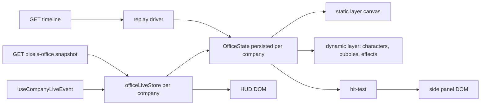

# Plan: Pixels Office v2 — dashboard visual yang hidup

Tanggal: 2026-10-02
Repo: `/home/zhafron/Projects/paperclip-pro` (main `d7ecc97d2`)
Pendahulu: `doc/plans/2026-10-01-pixels-office.md` (v1, sudah rilis 2026.1002.1)

Status: **MENUNGGU PERSETUJUAN**. Selain dokumen ini, belum ada file yang diubah.

---

## 0. Keputusan dari interview

| Topik | Keputusan |
|---|---|
| Bubble | Satu baris "aksi terakhir" dari run live. Ikon kecil selalu tampil; teks penuh muncul saat hover/klik |
| Klik karakter | Panel samping di dalam office |
| Aksi dari office | Wake, pause/resume, jawab interaction card, drag issue ke karakter (assign) |
| Fitur Paperclip | Status agent & issue, cases/pipelines, kolaborasi antar agent, approvals & interaction pending, budget/cost, routines |
| Posisi | Lanjut dari posisi terakhir (state sesi browser) |
| Peran | Dashboard alternatif lengkap, tetap divisualkan sebagai pixel |
| Skala | Sampai ~30 agent |
| Label | Titik status + nama pendek |
| Hidup | Day/night + jam real, perayaan saat done, asap/alarm saat error, timeline replay 24 jam, mini-map + follow-cam, suara ambient (default mati) |
| Aset | Dibuat dengan image model; sampel ditunjukkan dulu (lihat §7) |
| Rilis | Satu rilis besar |
| Tambahan | Performa harus tetap optimal (§5 adalah kriteria penerimaan) |

## 1. Temuan yang membentuk desain

Sumber: audit read-only dua subagent, ditambah verifikasi langsung.

### 1.1 Mengapa posisi selalu reset
- `OfficeState` dibuat di effect mount `PixelsOfficeCanvas` (`PixelsOfficeCanvas.tsx:85-103`) dan ikut dibuang saat unmount. Tidak ada yang ditulis ke storage.
- `addAgent` selalu memanggil `moveCharacterToSpawn` (`officeState.ts:206`), sehingga ~30 karakter menumpuk di satu tile koridor lalu berjalan ke kursinya masing-masing.
- `hueShift` tidak dipersist, jadi warna bisa berubah setiap reload.

### 1.2 Mengapa label besar dan saling tumpuk
- Teks label adalah nama penuh + `(Jabatan)` + `n/m` (`PixelsOfficeCanvas.tsx:42-53`), dengan font `max(10, 5*zoom)px sans-serif` (`agentLabels.ts:18-32`).
- Tidak ada `measureText` dan tidak ada declutter. Anchor-nya posisi karakter, sehingga karakter yang bertetangga saling tindih.

### 1.3 Tidak ada interaksi sama sekali
- Canvas tidak punya handler pointer, dan hit-test belum ada.
- `selectedAgentId`/`hoveredAgentId` di `OfficeState` tidak pernah diisi. Argumen `selection` di-hard-code `null` (`PixelsOfficeCanvas.tsx:185-191`), jadi outline seleksi adalah dead code.

### 1.4 Biaya render sekarang (hipotesis yang akan diukur di §5)
- rAF tanpa batas FPS. Setiap frame: menggambar ulang 1.628 tile tanpa culling, men-scan ulang dinding sambil mengalokasikan objek (`renderer.ts:275`), lalu membuat closure dan sort per entitas.
- `rebuildFurnitureInstances()` dipanggil setiap 0,2 detik dan setiap `setAgentActive` (`officeState.ts:253-309, 326-331`).
- Cache raster sprite di-key dengan zoom float. Setiap resize memicu rasterisasi ulang seluruh sprite, dan Map luarnya tidak pernah dievict (`spriteCache.ts:43-71`).
- BFS memakai key string dan `queue.shift()` (O(n) per pop) (`tileMap.ts:34-98`), lalu dijalankan ulang setiap frame selama karakter berjalan (`characters.ts:246-262`).

### 1.5 Data sudah tersedia; tidak perlu socket baru
- `heartbeat.run.progress` → `{agentId, runId, message (≤180), currentToolName, lastAssistantSnippet}` (`heartbeat.ts:8714-8728`). Ini sumber bubble yang tepat dan tidak butuh request tambahan.
- Kondisi awal saat halaman dibuka diambil dari `GET /companies/:id/live-runs` (`currentStatusMessage`, `currentToolName`).
- Issue, interaction, approval, budget, dan routine hanya datang lewat `activity.logged` (dibedakan oleh `action`). Cases/pipelines tidak punya event live, jadi harus di-poll.
- HUD: `GET /companies/:id/dashboard` sudah memuat agents/tasks/costs/pendingApprovals/budgets.
- Timeline 24 jam: belum ada rute yang memadai. `heartbeat_run_events` sudah punya index `(company_id, created_at)`. Dibutuhkan satu rute baru (§3.6).
- Kolaborasi: `addresseeAgentId` pada interaction card, `issue.child_created`, dan mention di komentar (`extractAgentMentionIds`).

## 2. Arsitektur v2



- **`officeLiveStore`** (modul, satu instance per company) menyimpan state turunan: progress per agent, status, pending interactions, efek yang antre, dan edge kolaborasi. Store ini diisi oleh snapshot dan event live, dan bertahan saat pindah halaman.
- **`OfficeState` persisten**: disimpan di registry modul per `companyId`, tidak di ref komponen. Saat unmount, loop berhenti tetapi state tetap utuh. Posisi, arah, state, palette, dan hue di-flush ke `sessionStorage` (throttle 2 detik, plus saat `pagehide`), sehingga refresh penuh juga melanjutkan dari posisi terakhir. Spawn di koridor hanya untuk agent yang benar-benar baru.
- **Canvas hanya untuk dunia pixel.** Panel, HUD, tooltip teks bubble, dan menu tetap DOM (React + komponen UI yang sudah ada). Alasannya: teks tetap tajam, aksesibel, dan memakai ulang komponen interaction card yang ada.

## 3. Fitur

### 3.1 Label (titik status + nama pendek)
- Isi label: nama depan (token pertama, maks 10 karakter). Di depannya titik status 3×3 px: hijau = running, kuning = queued/menunggu, abu = idle, biru = paused, merah = error, ungu = pending approval.
- Font bitmap pixel 5 px yang dirasterisasi sekali ke atlas, sehingga tidak ada `fillText` per frame. Latar berupa pill gelap semi-transparan.
- Declutter: label diurutkan berdasarkan y, lalu digeser vertikal secara greedy bila bertabrakan. Pada zoom kecil hanya label hover/selected/running yang tampil.
- Jabatan, jumlah task, dan run tampil di tooltip hover dan di panel.

### 3.2 Bubble "thinking"
- Sumber data: `heartbeat.run.progress`, dengan kondisi awal dari `live-runs`.
- Ikon kecil di atas kepala sesuai kategori tool: baca, tulis/edit, jalankan perintah, web, berpikir (titik-titik beranimasi), komentar. Pemetaan nama tool ke kategori ada di satu tabel.
- Hover atau klik pada karakter/bubble menampilkan tooltip DOM berisi `message` (≤180 karakter) dan umur update ("3 dtk lalu").
- Bubble hilang 10 detik setelah run selesai. Run yang error menyisakan ikon "!" sampai diklik.

### 3.3 Klik + panel samping + aksi
- Hit-test: kotak sprite karakter (16×32), diurutkan menurut z, plus kotak objek interaktif. Kursor berubah menjadi pointer saat hover.
- Panel karakter:
  - status, run live beserta pesan terakhir, dan daftar task (link ke issue)
  - interaction card pending, dijawab inline memakai komponen yang sudah ada
  - tombol **Wake**, **Pause/Resume**, link ke halaman agent, dan outline seleksi
- Drag issue ke karakter: baki "Belum di-assign" di HUD berisi issue `todo`/`backlog` tanpa assignee. Drop ke karakter mengirim `PATCH /issues/:id {assigneeAgentId}` dengan toast + undo. Aksi ini butuh `assertBoard`; tombolnya disembunyikan bila tidak berwenang.
- Objek yang bisa diklik:

| Objek | Panel |
|---|---|
| Papan kanban | Cases/pipelines per stage |
| Kotak surat ("!") | Approvals + interaction pending (attention) |
| Jam dinding | Routines dan jadwal berikutnya |
| Meteran koin | Cost bulan ini / budget, insiden budget |
| Lampu alarm | Run gagal terbaru, link ke log |

- Semua aksi memakai endpoint yang sudah ada dengan authz-nya masing-masing. Tidak ada endpoint mutasi baru.

### 3.4 Status, kolaborasi, perayaan, error
- **Status agent**:
  - running: duduk mengetik, monitor dan lampu meja menyala
  - idle: berkeliaran atau duduk di lounge
  - paused: tidur di meja dengan "zZ"
  - error: asap dari meja, lampu alarm berkedip
  - pending approval atau interaction yang menunggu manusia: "!" kuning
  - budget hard-stop: "zZ" plus ikon koin
- **Kolaborasi** (dari `activity.logged`):
  - `issue.thread_interaction_created` dengan addressee: pembuat berjalan ke meja addressee, lalu garis putus-putus tetap terlihat selama card masih pending
  - `issue.child_created`: delegator berjalan sebentar ke meja assignee
  - mention agent di komentar: bubble "@" singkat
  - Batas: setiap agent punya satu kunjungan aktif; event yang terlalu sering digabung.
- **Done**: `issue.updated` ke status `done` memicu confetti pixel dan karakter melompat. Bila issue punya ≥3 child, semua agent yang terlihat ikut bersorak.
- **Error**: `heartbeat.run.status` dengan `failed` memunculkan asap 3 frame dan lampu alarm. Klik membuka log run.

### 3.5 HUD (dashboard alternatif)
- Strip atas berisi chip:
  - run aktif, issue terbuka/blocked
  - pending approvals, cost bulan ini dibanding budget
  - jam lokal dan routine berikutnya
  - Setiap chip bisa diklik dan membuka panel yang sesuai.
- Ticker aktivitas di bawah: 1 baris berjalan dari `activity.logged`, dengan buffer maksimal 50 item.
- Sumber data:
  - `dashboard` di-refetch debounce 2 detik saat ada event relevan, dengan poll fallback 60 detik
  - `pipelines` dan `routines` di-poll 60 detik, hanya saat tab terlihat
  - `costs/summary` di-poll 5 menit

### 3.6 Timeline replay 24 jam
- Rute baru `GET /api/companies/:companyId/pixels-office/timeline?from&to` dengan `company_scope:read` dan flag eksperimental yang sama. Respons berupa event ringkas (maks 5.000, dengan cursor) dari:
  - `heartbeat_runs`: run mulai dan selesai per agent beserta status, berdasarkan `started_at`/`finished_at`
  - `activity_log`: action yang relevan (issue status, interaction, approval, routine, budget), berdasarkan `created_at`
- Sebelum implementasi, index pada `activity_log(company_id, created_at)` dan `heartbeat_runs(company_id, started_at)` diperiksa. Bila belum ada, ditambahkan lewat migrasi.
- UI: scrubber 24 jam dengan kecepatan 1×/10×/60×. Selama replay, event live ditahan dan engine digerakkan oleh driver replay. Tombol "Live" mengembalikan tampilan ke kondisi sekarang.
- Tidak menyimpan posisi historis. Gerakan direkonstruksi dari event dengan aturan yang sama seperti live.

### 3.7 Kamera, mini-map, suara, siang/malam
- Pan dengan drag, zoom dengan wheel. Zoom dibulatkan ke kelipatan bilangan bulat agar cache sprite terbatas.
- Follow-cam pada karakter terpilih memakai tween halus.
- Mini-map berupa canvas DOM kecil di pojok, dirender ulang hanya saat ada perubahan dengan frekuensi maksimal 4 Hz. Mini-map bisa diklik untuk loncat.
- Siang/malam: tint sesuai jam lokal, satu `fillRect` dengan composite multiply. Lampu meja agent yang running memancarkan glow (sprite additive yang di-cache).
- Suara ambient dari WebAudio synth tanpa file aset: ketikan saat ada agent running, "ding" saat done, alarm lembut saat error. Default mati; pilihan disimpan di `localStorage`.

### 3.8 Skala ~30 agent
- Kapasitas sekarang 34 kursi. Bila jumlah agent melebihi kursi yang tersedia, layout menambah ruangan overflow kedua (clone dengan recolor) secara deterministik.
- Preset kamera "Office/Boardroom/Overflow" diganti pan bebas + mini-map. Preset tetap tersedia sebagai tombol loncat.

## 4. Kontrak (dibekukan sebelum fan-out)

Tipe baru di `packages/shared/src/types/pixels-office.ts`:

```ts
interface PixelsOfficeAgent {
  // field v1 tetap ada, ditambah:
  pendingInteractionCount: number;
  awaitingBoardCount: number;
  budgetPaused: boolean;
  progress: { runId: string; message: string | null; toolName: string | null; updatedAt: string } | null;
}
interface PixelsOfficeCollaborationEdge { fromAgentId: string; toAgentId: string; kind: "interaction" | "delegation"; issueId: string; since: string }
interface PixelsOfficeSnapshot { /* v1 + */ collaboration: PixelsOfficeCollaborationEdge[] }
interface PixelsOfficeTimelineEvent { at: string; agentId: string | null; kind: "run_started" | "run_finished" | "issue_status" | "interaction" | "approval" | "routine" | "budget"; issueId?: string; status?: string; otherAgentId?: string }
interface PixelsOfficeTimeline { events: PixelsOfficeTimelineEvent[]; nextCursor: string | null }
```

Snapshot bertambah paling banyak 2 query: interaction pending per agent dan budget paused. Progress diambil dari Map runtime in-memory, sehingga tidak ada query tambahan.

## 5. Performa (kriteria penerimaan)

**Baseline diukur sebelum ada kode yang diubah.** Lingkungan: instance throwaway dengan 30 agent, 10 di antaranya running. Chromium headless, 1440×900, DPR 1, diukur selama 20 detik:
- `Performance.getMetrics` (ScriptDuration, TaskDuration, LayoutDuration) per detik
- p50/p95 waktu frame dari selisih rAF
- heap JS setelah 60 detik

Target v2 pada skenario yang sama, ditambah semua efek aktif:
- ScriptDuration per detik ≤ 50% baseline
- p95 frame ≤ 16,7 ms
- heap tidak tumbuh lebih dari 5 MB dalam 5 menit
- **0 alokasi objek per frame** di jalur render steady-state (dicek dengan sampling heap profile)
- Tab tersembunyi: 0 rAF dan 0 poll

Teknik:
1. Layer statis (tile, dinding, furniture statis) dirender ke `OffscreenCanvas`/canvas offscreen sekali per (zoom, layout). Per frame cukup satu `drawImage` dengan culling viewport.
2. Instance dinding dan furniture di-cache dan dibangun ulang hanya saat layout berubah. Hapus rebuild per 0,2 detik; state monitor on/off digambar di layer dinamis.
3. Zoom dibulatkan ke integer, dan cache sprite dibatasi (LRU 2 level zoom).
4. BFS memakai indeks numerik dengan `Int32Array` dan queue berbasis head index. Path di-cache per (dari, ke) dan di-invalidate saat layout berubah. Hapus re-path per frame.
5. Render terkunci 30 FPS (animasi sprite memang ≤10 FPS). Bila tidak ada karakter yang bergerak, tidak ada efek aktif, dan tidak ada interaksi, render berhenti sampai ada event (idle sleep).
6. Label dan bubble memakai atlas glyph pixel dan posisinya dihitung ulang hanya saat karakter bergerak atau teks berubah.
7. Event live dikumpulkan dalam satu batch per frame. Snapshot di-refetch dengan debounce dan tidak menyentuh engine bila datanya tidak berubah (diff berbasis key).

## 6. Rencana kerja (fan-out setelah kontrak beku)

| Slice | Isi | File utama |
|---|---|---|
| A. Engine core | Persistensi, hit-test, kamera pan/zoom/follow, layer statis, BFS, FPS cap/idle sleep, overflow room | `ui/src/lib/pixels-office/engine/*`, `layout/*`, `sprites/spriteCache.ts` |
| B. Server | Perluasan snapshot, rute timeline + index, tes embedded Postgres, openapi/MCP regen | `server/src/services/pixels-office.ts`, `routes/pixels-office.ts`, `packages/db` (bila perlu index) |
| C. UI shell | Live store, panel samping + aksi, HUD, baki drag-assign, tooltip bubble, timeline scrubber, mini-map | `ui/src/pages/PixelsOffice.tsx`, `ui/src/components/pixels-office/*` |
| D. Visual & efek | Label pixel, ikon bubble, pose status, kolaborasi, confetti, asap/alarm, siang/malam, glow, suara, aset baru | `engine/renderer.ts`, `engine/effects/*`, `ui/public/pixels/*` |

Urutannya: aku membekukan kontrak (§4) dan mengukur baseline (§5). Setelah itu A, B, C, D jalan paralel; D bergantung pada API render dari A, jadi A memublikasikan interface layer lebih dulu. Integrasi dan verifikasi akhir aku kerjakan sendiri.

## 7. Aset baru (sampel sudah dibuat, perlu pilihanmu)

Pipeline yang sudah teruji:
1. Image model (`google/gemini-3-pro-image` via openrouter) membuat sheet objek dengan latar magenta.
2. Script memotong per sel, membuang chroma key, me-resize BOX ke ~24 px, dan mengkuantisasi ke 16 warna.
3. Hasilnya dibandingkan berdampingan dengan furniture yang sudah ada.

Sampel: `/tmp/pxasset/compare.png` (baris atas = aset yang sudah ada, baris bawah = hasil generate). Objeknya: papan kanban, meteran koin, jam, lampu alarm, asap 3 frame, confetti, kotak surat, lampu meja.

Script, prompt, dan aset final masuk ke `scripts/pixels-assets/` dan `ui/public/pixels/furniture/`. Setelah pipeline terbukti di produk, langkahnya dijadikan skill (sesuai permintaanmu).

## 8. Verifikasi

- Unit: hit-test (urutan z), declutter label, round-trip persistensi, pemetaan tool→ikon, reducer live store (event → efek), driver replay.
- Server: authz snapshot/timeline (agent tanpa company scope → 403), batas dan cursor timeline, query count snapshot. Negative control: setiap tes harus gagal tanpa perubahannya.
- Live: instance throwaway dengan 30 agent.
  - pindah menu lalu kembali: posisi sama (dibandingkan lewat dump koordinat)
  - refresh: posisi sama
  - klik karakter: panel terbuka; wake/pause berhasil; drag assign berhasil
  - bubble mengikuti progress
  - replay berjalan
  - screenshot sebelum/sesudah untuk label
- Performa: angka baseline dan sesudah dari skenario §5 dilaporkan berdampingan.
- Gate repo: `pnpm -r typecheck`, `pnpm test:run`, `pnpm build`, `check:token-gates`, `check:mcp-tools`, comment gate.

## 9. Risiko

- **Event bocor ke actor tanpa izin**: socket sudah dibatasi per company. Progress message hanya ditampilkan bila snapshot (yang butuh `company_scope:read`) lolos, sehingga agent dengan scope sempit tidak melihat bubble.
- **Timeline berat**: dibatasi 24 jam, maks 5.000 event, dan memakai index. Tanpa index yang memadai, migrasi ditambahkan.
- **Ukuran bundle**: semua kode Pixels sudah lazy route. Aset baru < 50 KB total PNG.
- **Satu rilis besar**: risiko regresi lebih besar. Mitigasinya: fitur tetap di balik flag eksperimental, dan smoke live dijalankan sebelum merge.

## 10. Di luar cakupan

- Editor layout oleh user.
- Multi-lantai dengan navigasi antar gedung (cukup overflow room hingga ~50 agent).
- Persistensi posisi di server (keputusan interview: cukup sesi browser).
