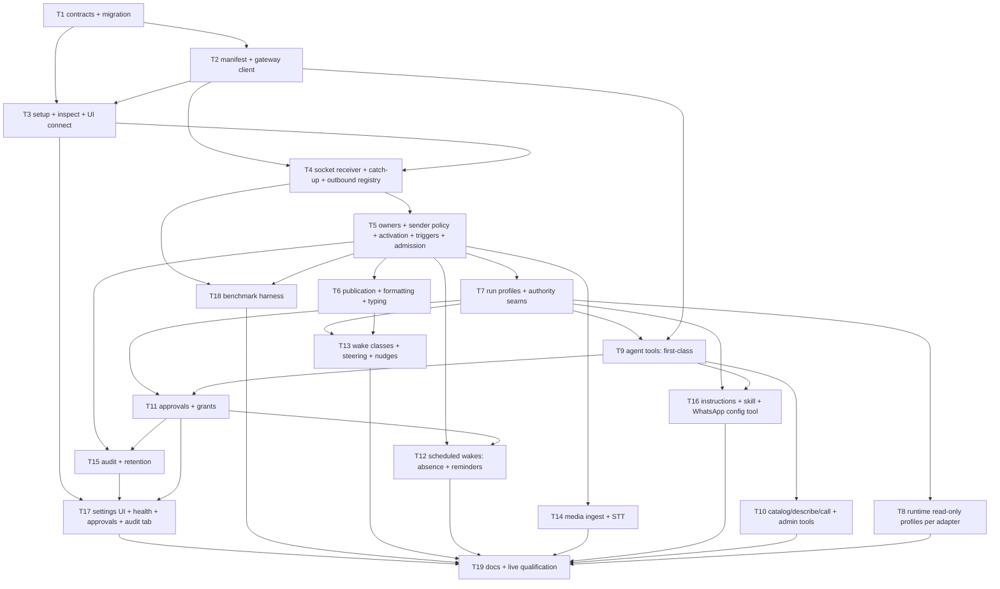

# Implementation Plan: OpenWA chat connector

Date: 2026-10-03. Spec (locked contract): [`2026-10-03-openwa-connector.md`](./2026-10-03-openwa-connector.md) v3.
Release: one release containing every task below (D18). Tasks are vertical where the code allows; every task leaves the tree building and its own tests green.
Tracking: this file. The repo uses no `tasks/` directory; plan documents live in `doc/plans/` (AGENTS.md rule 5).

## Gate commands

Every gate uses the PATH shim from the `run-paperclip-pro-gates-safely` skill: `bash /tmp/pb/go.sh <pnpm args>` (Node 24 through fnm, corepack pnpm, cargo on `PATH`). Never run `pnpm test:run`: its chat-shards preflight runs `pnpm install` and destroys `node_modules`. Never run the `cli` install/uninstall tests: they act on the real `paperclip-pro.service`. Targeted tests: `bash /tmp/pb/go.sh vitest run <paths>`. The broad run `bash /tmp/pb/go.sh vitest run --exclude '**/vitest-chat-shards.test.ts' --exclude '**/dist/**'` takes over an hour and runs once, at Checkpoint E, against a `main` baseline.

## Overview

New chat provider `openwa` on the existing chat subsystem (Photon is the structural template: in-repo `Adapter`, lease-elected stream receiver, provider-specific inspect route). New provider-neutral policy layer (owners, sender rules, scheduled wakes, approvals, grants, outbound registry, audit) enabled only for `openwa`. New per-run authority (`run profile`) enforced at a closed list of seams. Agent tools exposed through the native runner, an HTTP route, and a Paperclip MCP toolset. One Socket.IO dependency.

## Architecture decisions

| Decision | Rationale |
| --- | --- |
| Policy tables are provider-neutral (`chat_*`) but admission uses them only when `provider = openwa` | Spec scope; avoids changing other providers' behaviour |
| Run profile is computed once at run start, stored in the run context, re-read by every gate | Immutable authority, no per-call grant scans; fail-closed default for OpenWA conversation issues |
| `assertOpenwaRunMay(run, category)` lives in one module (`server/src/services/openwa/authority.ts`) and every seam imports it | One predicate, one negative-control test per seam |
| Operation manifest is generated from the pinned OpenAPI file and checked in | Reviewable allowlist; no path reflection |
| Classification is synchronous and in-memory; DB only for trigger candidates | S0 budget |
| Gateway HTTP via the existing undici keep-alive agent; Socket.IO via `socket.io-client` | Only new dependency (ask-first item) |
| OMP `read_only` enforcement via the existing tool-guard extension returning `{block: true, reason}` | OMP `ToolCallEventResult` supports `block` (`@oh-my-pi/pi-coding-agent` `shared-events.d.ts:247-251`); `--tools` cannot express "default set minus writes" |

## Dependency graph

## Phase 0: Prerequisites (operator)

### P0-a: Approve the `socket.io-client` dependency

Ask-first boundary (spec §20). Alternative if refused: a minimal Engine.IO v4 + Socket.IO v5 client over the existing `ws` dependency (`server/package.json:111`), which adds T4 scope.

### P0-b: Gateway preparation (approval required, separate from code)

`~/Projects/openwa-docker/.env`: `SEND_PACING_ENABLED=true`, `RESOLVE_LID_TO_PHONE=true`; restart the gateway; create a dedicated operator key scoped to the session without `allowedChats`. Needed only from T4 onward for live checks; all automated tests use the fake gateway.

## Phase 1: Foundation

### T1: Contracts and migration

**Description:** Add `openwa` to the provider enum and every exhaustive provider table; add all spec §12 schema in one migration; shared types/validators for the endpoint policy; OpenAPI schemas; regenerate `api-tools.json`.

**Acceptance criteria:**
- [ ] `CHAT_PROVIDERS` includes `openwa`; every exhaustive `Record<ChatProvider, …>` and `switch` compiles with an explicit `openwa` branch (`PROVIDER_LABELS`, `CAPABILITIES` with truthful flags, `REQUIRED_CREDENTIALS`, `SUPPLIED_CREDENTIAL_KEYS`, `leasedChatProvider` -> leased, `providerResourceType`, `chatSurfaceKind`, setup projector, `parseChatProviderLifecycle`).
- [ ] Migration adds: `chat_endpoints.policy`, `policy_revision`, `inflight_mode`; provider check constraints; partial unique indexes for openwa; `chat_endpoint_resources.settings`; `chat_external_principals.alternate_external_ids`; `chat_deliveries.trigger_class|principal_role|answer_state`; tables `chat_endpoint_owners`, `chat_sender_rules`, `chat_scheduled_wakes`, `chat_owner_approval_requests`, `chat_outbound_messages`, `chat_owner_approval_bubbles`, `chat_owner_grants`, `chat_audit_entries`; all with `company_id` and composite `(company_id, endpoint_id)` FKs.
- [ ] `openwaEndpointPolicySchema` and per-chat settings schema validate defaults from spec §6/§7; `ISSUE_THREAD_INTERACTION_CANONICAL_RESOLVER_POLICIES` includes `chat_endpoint_owner`.

**Verification:**
- [ ] `bash /tmp/pb/go.sh db:generate` produces one migration; `bash /tmp/pb/go.sh -r typecheck` and `bash /tmp/pb/go.sh --filter @tickernelz/paperclip-pro-db run check:migrations` pass.
- [ ] Migration applies to a fresh PGlite DB and to a DB at `0286` (test).
- [ ] Validator unit tests: defaults, bounds, rejection of unknown keys.

**Dependencies:** None. **Files:** `packages/shared/src/types/chat-channels.ts`, `packages/shared/src/validators/chat-channels.ts`, `packages/shared/src/constants.ts`, `packages/db/src/schema/chat_channels.ts`, `packages/db/src/schema/index.ts`, `packages/db/src/migrations/0287_*.sql`, `server/src/services/chat-channels.ts` (enum fan-out only), `server/src/routes/openapi.ts`, `packages/mcp-server/src/generated/api-tools.json`. **Scope:** L (mechanical fan-out; acceptable because the enum must change atomically).

### T2: Operation manifest and gateway client

**Description:** Generator script reads `doc/connections/openwa/openapi-0.23.7.yaml` (checked-in copy of the live spec) and emits `packages/shared/src/openwa-operations.ts`: 202 operations (OpenWA 0.23.7) with id, method, path, zod args, category, `requiredKey`, `sessionScoped`, `crossChat`, engine availability (static whatsapp-web.js/Baileys matrix from the spec §3 source). Server client `server/src/services/openwa/gateway.ts`: keep-alive pool, `X-API-Key` injection, `sessionId` injection, typed errors (501 -> `unavailable_on_engine`, 429 `SEND_PACING_LIMITED` -> `retry_after`, throttle 429, 401/403, 5xx, timeout -> `uncertain` for sends).

**Acceptance criteria:**
- [ ] Manifest has exactly 202 entries (OpenWA 0.23.7); every gateway admin route is `gateway_admin` with `requiredKey` per spec §3.
- [ ] Client never logs or returns the key; error mapping matches spec §8.5.
- [ ] Generator is deterministic (re-run produces no diff).

**Verification:** unit tests against a local HTTP fake; `node scripts/generate-openwa-operations.mjs && git diff --exit-code packages/shared/src/openwa-operations.ts`.

**Dependencies:** T1. **Files:** `scripts/generate-openwa-operations.mjs`, `doc/connections/openwa/openapi-0.23.7.yaml`, `packages/shared/src/openwa-operations.ts`, `server/src/services/openwa/gateway.ts`, tests. **Scope:** M.

### T3: Setup, inspection and connect UI

**Description:** App definition `openwa` (ingest script + generated JSON + brand asset), `POST /chat-endpoints/:endpointId/openwa/inspect` (spec §5.2 steps 0-6), configure flow storing credentials in the vault, reservation indexes, attestations, JWT-adapter requirement, setup wizard steps in `ChatEndpointSetup.tsx` up to "owner test DM".

**Acceptance criteria:**
- [ ] Inspect returns version/engine/role/sessions/masked number; `allowedChats` key -> 422; multi-session key -> warning; gateway down -> 503 message "do not replace credentials".
- [ ] Agent with a non-JWT adapter -> 422 at configure; switching the agent's adapter later sets `attention`.
- [ ] Second endpoint on the same `(origin, session)` -> 409.

**Verification:** route tests with the fake gateway; UI test for the wizard steps; `bash /tmp/pb/go.sh check:token-gates`.

**Dependencies:** T1, T2. **Files:** `scripts/ingest-app-definitions.mjs`, `packages/shared/src/app-definitions/openwa.json`, `packages/shared/src/app-definitions*.ts`, `ui/public/brands/apps/openwa.*`, `ui/public/brands/apps/manifest.json`, `server/src/routes/chat-channels.ts`, `server/src/services/openwa/setup.ts`, `ui/src/pages/apps/chat/ChatEndpointSetup.tsx`. **Scope:** M.

### Checkpoint A (after T1-T3)
- [ ] `bash /tmp/pb/go.sh -r typecheck`, targeted `bash /tmp/pb/go.sh vitest run <paths>`, `bash /tmp/pb/go.sh check:token-gates` green.
- [ ] Live: inspect against `http://localhost:2785` with the dedicated key shows the real session (read-only).

## Phase 2: Ingress and conversation core

### T4: Socket receiver, catch-up, outbound registry

**Description:** `server/src/services/openwa/receiver.ts`: lease-elected Socket.IO consumer (Photon receiver pattern, lease key `openwa_receiver_runtime`), subscription set (spec §5.4), bounded live buffer, backward catch-up walk with stop rules, ascending processing, cursor in `chat_sdk_state`, throttled writes. `server/src/services/openwa/outbound.ts`: `chat_outbound_messages` lifecycle (`pending` -> `sent`/`uncertain`/`failed`), 7-day in-memory index preloaded at lease start, echo classification, uncertain reconciliation. `server/src/services/openwa/adapter.ts`: `Adapter<OpenwaThread, OpenwaMessage>` mirroring `photon/adapter.ts` (postMessage throws; sends go through the publication identity). Fake gateway fixture `server/src/__tests__/openwa/fake-gateway.ts` (Socket.IO + REST, sequence numbers, latency knob).

**Acceptance criteria:**
- [ ] Reconnect mid-stream: every message admitted exactly once (sequence check), including rows without `waMessageId`.
- [ ] Echo of a registered send ignored; a send that crashed before 201 is reconciled, never classified phone-typed.
- [ ] Lease failover: second process takes over without duplicate admission.
- [ ] Spec AC15 ingress negative controls: after a restart the agent's own message quoting its approval bubble is not treated as an owner approval; a crash between send and 201 never turns the agent's message into an owner trigger.

**Verification:** integration tests on embedded Postgres with the fake gateway, including the crash-between-send-and-201 negative control.

**Dependencies:** T2, T3, P0-a. **Files:** `server/src/services/openwa/{receiver,outbound,adapter,state}.ts`, `server/src/services/chat-sdk-runtime.ts`, `server/src/services/chat-channels.ts` (lease wiring), `server/package.json`, tests. **Scope:** L (split if it exceeds one session: T4a receiver+catch-up, T4b outbound registry).

### T5: Owners, sender policy, activation, triggers, admission

**Description:** `server/src/services/openwa/policy.ts`: in-memory snapshot keyed by `policy_revision`; classification pipeline (spec §5.4 steps 1-7); owner derivation per turn from identity links + memberships; LID learning; sender matrix; chat activation incl. group discovery and owner-presence evaluation; trigger rules; admission bypassing the guest ladder (no sponsor-guest, no sticky low-trust); conversation issues with idle rotation; `/new`, `/status`, `/close`; owners CRUD + identity link flow reuse.

**Acceptance criteria:**
- [ ] Spec AC3 and AC4 pass (sender policy, group activation, `group_added` wake).
- [ ] Member trigger followed by owner trigger in the same group: the conversation issue is never converted to `low_trust_review`.
- [ ] Non-trigger message: zero DB queries (query counter in test).

**Verification:** unit tests for the sender matrix and trigger rules; integration tests for admission and rotation.

**Dependencies:** T4. **Files:** `server/src/services/openwa/{policy,admission,owners}.ts`, `server/src/services/chat-channels.ts` (admission branch), `server/src/routes/chat-channels.ts` (owners/sender rules routes), tests. **Scope:** L (split: T5a owners+sender rules+snapshot, T5b triggers+activation+admission).

### T6: Publication, formatting, typing

**Description:** Markdown->WhatsApp formatter and splitter; publication through the outbound registry; per-trigger `answer_state` and the publish rule (spec §7.4-7.5); `owner_number` prefix; typing presence; exclusion of OpenWA from generic interaction publication.

**Acceptance criteria:**
- [ ] Spec AC10 passes (single publication, tool-reply dedupe, silence, `ask_owner` suppression audited).
- [ ] Formatter golden tests for every construct in spec §10; split under 4096; >3 parts -> attachment.
- [ ] Redaction via `projectSafeChatPublicationText` applied (credential sample redacted).

**Verification:** unit + integration tests.

**Dependencies:** T5. **Files:** `server/src/services/openwa/{format,publication}.ts`, `server/src/services/chat-publication-text-parts.ts`, `server/src/services/chat-interaction-publications.ts`, `server/src/services/chat-run-publications.ts`, tests. **Scope:** M.

### Checkpoint B (after T4-T6)
- [ ] Owner DM -> agent reply round trip on the fake gateway end to end.
- [ ] Live (after P0-b): owner DM to the real number gets the agent's reply; group activation with owner present.

## Phase 3: Authority

### T7: Run profiles and authority seams

**Description:** `server/src/services/openwa/authority.ts`: profile resolution at run start (fail-closed for OpenWA conversation issues), `assertOpenwaRunMay`, read-only REST allowlist. Wire every seam in spec §13 except runtime tools: JWT REST middleware, persistent agent-key deny, issue create/assign/delegate/project create, native runner tools, tool-gateway connector writes, email/agentmail, GitHub credential export and `connection_request` (pre-middleware routes), mention-wake suppression for `read_only` comments.

**Acceptance criteria:**
- [ ] Spec AC5 (Paperclip-side parts) and AC19 pass.
- [ ] Each seam has a negative-control test that fails when its `assertOpenwaRunMay` call is removed.
- [ ] Runs on non-OpenWA issues are unaffected (existing suites green).
- [ ] Spec AC18: another company's board users, agents and endpoints cannot read or use this endpoint's grants, chats or tools (route and service tests).

**Verification:** route/service tests per seam; `bash /tmp/pb/go.sh vitest run` over the existing suites that own every touched module.

**Dependencies:** T5. **Files:** `server/src/services/openwa/authority.ts`, `server/src/middleware/auth.ts`, `server/src/routes/connection-intents.ts`, `server/src/services/github-operation-credentials.ts`, `server/src/services/native-runtime/paperclip-runner-tool-authority.ts`, `server/src/services/tool-gateway.ts`, `server/src/services/project-tool-context.ts`, `server/src/services/email-channels.ts`, `server/src/services/connectors/agentmail.ts`, `server/src/routes/issues.ts` (mention wakes), `server/src/services/heartbeat.ts` (profile at run start), tests. **Scope:** L (split: T7a profile + REST seams, T7b service seams + mention suppression).

### T8: Runtime read-only profiles

**Description:** Adapter capability `readOnlyToolProfile` and per-run application: OMP tool-guard blocks write tools (`edit`, `write`, `ast_edit`, notebook writes, rename/code-action apply) via `{block: true, reason}`, `bash` allowed (D32); Codex adds `--sandbox read-only`; Claude adds disallowed write tools; other JWT adapters (cursor, gemini, grok, kimi, opencode, pi, process, hermes) mapped or declared instruction-only with a Settings warning. Open item §22.2 is resolved here.

**Acceptance criteria:**
- [ ] In a `read_only` OMP run, `edit` is refused with the reason text; `read`/`grep`/`bash` work.
- [ ] Codex/Claude argument builders include the read-only flags only for `read_only` runs.
- [ ] Capability table documented in `doc/connections/OPENWA.md`.

**Verification:** adapter unit tests (argument builders, guard script); one live OMP run in `read_only` profile.

**Dependencies:** T7. **Files:** `packages/adapter-utils/src/types.ts`, `packages/adapters/omp-local/src/server/{tool-guard,execute}.ts`, `packages/adapters/codex-local/src/server/codex-args.ts`, `packages/adapters/claude-local/src/server/execute.ts`, other adapters' capability flags, tests. **Scope:** M.

### Checkpoint C (after T7-T8)
- [ ] AC5 and AC19 green on embedded Postgres; existing chat and issue suites green.
- [ ] Human review of the seam table against the code before continuing.

## Phase 4: Tools, approvals, timers, steering

### T9: First-class agent tools and exposure

**Description:** `openwa_send`, `openwa_read_chat`, `openwa_get_media`, `openwa_find`, `openwa_stay_silent`, `openwa_handoff`; tool authority resolving context from the run; exposure via native runner tools, `POST /api/companies/:companyId/openwa/tasks/:issueId/tools`, and Paperclip MCP toolset `openwa`; idempotency keys and action receipts; 16 KB result cap with cursors.

**Acceptance criteria:**
- [ ] Mentions render (array + `@n`), quotes resolve, `quote_unresolvable` typed; `number_not_on_whatsapp` precheck.
- [ ] `read_only` run: origin-chat send allowed under reply policy; other chat -> `approval_required(cross_chat_send)`.
- [ ] Tool schema token count <= 3k (tokenizer script in test).

**Verification:** tool tests with the fake gateway; MCP server toolset test.

**Dependencies:** T7, T2. **Files:** `packages/shared/src/openwa-tools.ts`, `server/src/services/openwa/tools.ts`, `server/src/routes/openwa-tools.ts`, `server/src/services/native-runtime/paperclip-runner-tool-authority.ts`, `packages/mcp-server/src/*` (toolset), tests. **Scope:** L (split: T9a send/read/find, T9b media/silent/handoff + exposure).

### T10: Catalog, describe, call, gateway admin

**Description:** `openwa_catalog`, `openwa_describe`, `openwa_call` over the manifest; per-operation category gating; `gatewayAdminTools` levels; `adminApiKey`; self-session protection; 501 learning cache per engine; Paperclip-side operation `paperclip.audit.list` (owner-only).

**Acceptance criteria:**
- [ ] Spec AC12 passes.
- [ ] Every manifest operation is callable with schema-validated args or returns a typed unavailability reason.

**Verification:** manifest-driven parameterized test against the fake gateway (all 202 operations (OpenWA 0.23.7): dispatch or typed refusal).

**Dependencies:** T9. **Files:** `server/src/services/openwa/{catalog,call}.ts`, tests. **Scope:** M.

### T11: Approvals and grants

**Description:** `openwa_request_approval` (create, remind), `openwa_approval_resolve`; request + interaction (`chat_endpoint_owner`, `continuationPolicy: none`) + outbound bubbles; approval-reply detection before activation; WhatsApp and Paperclip resolution with row lock; grants (`one_action`, `requester`) resolved at run start; revocation on owner loss; `approval_resolved` wakes; generic resolve routes enforce the new resolver policy.

**Acceptance criteria:**
- [ ] Spec AC6 and AC7 pass, including every negative control.
- [ ] Resolve race (WhatsApp vs UI) yields exactly one resolution (concurrent test).
- [ ] Spec AC15 approval parts: self-chat approval works in `owner_number` mode; owner replies to approval bubbles are detected without enabling any chat.

**Verification:** integration tests on embedded Postgres.

**Dependencies:** T7, T9. **Files:** `server/src/services/openwa/approvals.ts`, `server/src/services/issue-thread-interactions.ts`, `server/src/services/issue-thread-interaction-resolution.ts`, `server/src/routes/issues.ts` (resolve routes), tests. **Scope:** L (split: T11a request + bubbles + detection, T11b resolution + grants).

### T12: Scheduled wakes: absence timers and reminders

**Description:** `chat_scheduled_wakes` service with an in-process min-heap owned by the lease holder; absence timer arm/attach/cancel/fire/late-owner rules; approval reminders; rebuild on restart.

**Acceptance criteria:**
- [ ] Spec AC8 passes; restart rebuild fires within 2 s of `fireAt` (AC16 part).
- [ ] No periodic polling (test asserts timer-driven wakeups only).

**Verification:** fake-clock unit tests; integration test with restart.

**Dependencies:** T5, T11. **Files:** `server/src/services/openwa/scheduled-wakes.ts`, tests. **Scope:** M.

### T13: Wake classes, steering, progress nudges

**Description:** `payload.openwa.triggerClass`; same-class predicate in `admitWakeBehindIssueExecution` (active-run merge and `findExistingDeferredWake`); steering table (spec §7.3) with a server-side steer call via the queued-comment path and `hasLiveAdapterSteering`; follow-up owner runs for unanswered/handed-off owner triggers; progress nudges; `inflight_mode`.

**Acceptance criteria:**
- [ ] Spec AC9 passes with its negative control; AC2 steering part passes with an OMP RPC target and falls back to queue for a non-steering adapter.
- [ ] Nudge schedule: first at 60 s, then every 180 s, max 5, none after a send to the origin chat.

**Verification:** wake-queue unit tests; integration test with a fake steer target.

**Dependencies:** T7, T6. **Files:** `server/src/modules/wake-queue/application/use-cases.ts`, `server/src/modules/wake-queue/adapters/postgres.ts`, `server/src/services/openwa/{steering,nudges}.ts`, `server/src/routes/issues.ts` (steer entry refactor), tests. **Scope:** L (split: T13a wake classes, T13b steering + nudges).

### T14: Media ingest and speech-to-text

**Description:** Trigger-media ingestion worker (attachment policy, 30 s per file, `pending` fallback); instance `speechToText` settings (schema, UI field, env-var key); transcription client; `sttWaitSeconds` and late transcript steering.

**Acceptance criteria:**
- [ ] Spec AC11 passes (image, document, location, contact, voice note; transcript with STT on; bounded wait).
- [ ] STT failure keeps the audio and records `transcript_unavailable`.

**Verification:** integration tests with a fake STT endpoint.

**Dependencies:** T5. **Files:** `server/src/services/openwa/media.ts`, `server/src/services/speech-to-text.ts`, `packages/shared/src/validators/instance.ts`, `server/src/services/instance-settings.ts`, `ui` instance settings page, tests. **Scope:** M.

### T15: Audit and retention

**Description:** `chat_audit_entries` writer used by T4-T14 call sites; metadata-only `activity_log` actions; `GET /chat-endpoints/:endpointId/audit` with content vs metadata access; daily purge job in batches.

**Acceptance criteria:**
- [ ] Spec AC14 passes (owner sees content, plain board user metadata only, time-travel purge).
- [ ] Every action in spec §11 is emitted by at least one integration test.
- [ ] Spec AC18 audit part: another company cannot read this endpoint's audit entries.

**Verification:** integration tests.

**Dependencies:** T5, T11. **Files:** `server/src/services/openwa/audit.ts`, `server/src/routes/chat-channels.ts`, job registration, tests. **Scope:** M.

### T16: Instructions, skill, WhatsApp config tool

**Description:** Built-in English guidance (versioned) and per-wake injection (agent instructions + guidance + custom instructions + chat note) through the task markdown path (`packages/adapter-utils/src/server-utils.ts:2185-2194`); wake payload (spec §9.3); bundled `skills/openwa/SKILL.md`; `openwa_endpoint_config` (owner-only, before/after audit).

**Acceptance criteria:**
- [ ] Edited custom instructions apply on the next wake without new issues.
- [ ] Spec AC13 passes.
- [ ] Skill text reviewed against the tool schemas (no stale names).

**Verification:** prompt snapshot tests limited to presence of policy facts; config tool integration test.

**Dependencies:** T7, T9. **Files:** `server/src/services/openwa/guidance.ts`, `server/src/services/chat-communication-guidance.ts`, `skills/openwa/SKILL.md`, `server/src/services/openwa/config-tool.ts`, tests. **Scope:** M.

### Checkpoint D (after T9-T16)
- [ ] Spec AC2-AC16, AC18 and AC19 green on the fake gateway.
- [ ] `bash /tmp/pb/go.sh -r typecheck` green; targeted `bash /tmp/pb/go.sh vitest run` over every OpenWA test and every suite owning a touched module green.

## Phase 5: Operator surface, performance, qualification

### T17: Settings UI, health, approvals list, audit tab

**Description:** Settings sections from spec §14 (owners, sender lists, chats with picker, approvals, reminders, grant TTL, rotation, in-flight mode, nudges, typing, prefix, gateway admin + admin key, custom instructions, retention, capability warnings), Health card, pending approvals list with resolve, Audit tab with filters.

**Acceptance criteria:**
- [ ] Every policy field round-trips through the API; validation errors surface inline.
- [ ] Visual check on a throwaway instance (screenshots in the verification record).

**Verification:** UI tests; `bash /tmp/pb/go.sh check:token-gates`; throwaway-instance screenshot pass.

**Dependencies:** T3, T11, T15. **Files:** `ui/src/pages/apps/chat/*`, `ui/src/api/*`, tests. **Scope:** L (split: T17a settings + health, T17b approvals + audit tab).

### T18: Benchmark harness

**Description:** `scripts/bench/openwa-ingest.mjs` with the fake gateway (latency knob, sequence numbers, DB query counter), Telegram admission baseline on the same harness, seams S0-S5, burst and reconnect scenarios, negative control (injected query fails S0).

**Acceptance criteria:**
- [ ] Spec AC17: all budgets met; numbers and baseline recorded.
- [ ] Negative control fails as expected.

**Verification:** `node scripts/bench/openwa-ingest.mjs` output committed to the verification record.

**Dependencies:** T4, T5 (re-run after T13/T14). **Files:** `scripts/bench/openwa-ingest.mjs`, fixture reuse. **Scope:** M.

### T19: Documentation and live qualification

**Description:** `doc/connections/OPENWA.md` (runbook: setup, modes, policy, approvals, tools, adapter capability table, troubleshooting), `doc/connections/OPENWA-VERIFICATION.md` (dated live results vs fixtures), references in `doc/PRODUCT.md`, `doc/SPEC-implementation.md`, `doc/connections/README.md`; live run of AC1-AC19 against the real gateway and number with a test-only agent.

**Acceptance criteria:**
- [ ] Every AC has a live result or an explicit "fixture only" reason.
- [ ] `bash /tmp/pb/go.sh -r typecheck`, `bash /tmp/pb/go.sh build`, `bash /tmp/pb/go.sh check:token-gates`, `bash /tmp/pb/go.sh --filter @tickernelz/paperclip-pro-db run check:migrations` green; broad `bash /tmp/pb/go.sh vitest run --exclude '**/vitest-chat-shards.test.ts' --exclude '**/dist/**'` with every failure classified against a `main` baseline; suites not run listed.

**Verification:** the verification record itself.

**Dependencies:** all. **Files:** docs only. **Scope:** M.

### Checkpoint E (complete)
- [ ] All spec acceptance criteria met with evidence.
- [ ] Review gate (`review-gate-before-commit`) passed; comment gate clean.
- [ ] Ready for the user's ship decision.

## Parallelization

- Sequential spine: T1 -> T2 -> T4 -> T5 -> T7.
- After T5: T6, T14, T15 (partial) in parallel. After T7: T8, T9, T13 in parallel. After T9: T10, T11, T16 in parallel. T17 and T18 run alongside Phase 4 once their inputs exist.
- Shared files needing one owner per wave: `server/src/services/chat-channels.ts`, `server/src/routes/chat-channels.ts`, `server/src/routes/issues.ts`, `packages/shared/src/types/chat-channels.ts`.

## Risks and mitigations

| Risk | Impact | Mitigation |
| --- | --- | --- |
| `chat-channels.ts` (38k lines) merge conflicts across parallel tasks | High | New logic lives in `server/src/services/openwa/*`; `chat-channels.ts` only gets thin provider branches; one integration owner per wave |
| Seam coverage incomplete (new mutation path missed) | High | Fail-closed profile on OpenWA issues; REST allowlist denies by default; Checkpoint C human review |
| Steering refactor regresses the existing UI steer route | Medium | Server-side entry reuses `decideQueuedCommentQueueSteering`; existing steer tests stay green |
| Socket.IO dependency refused | Medium | P0-a fallback over `ws` (adds T4 scope) |
| Live gateway behaviour differs from docs (catch-up, LID) | Medium | Fake gateway encodes doc behaviour; Checkpoint B live probes early |
| Account ban during live tests | Medium | Pacing on (P0-b); test only with the owner's contacts |
| Single release (D18) means late integration bugs | Medium | Checkpoints A-E with live probes from Checkpoint B onward |

## Open questions

- P0-a: approve `socket.io-client`?
- P0-b: approve the gateway `.env` change and key creation, and when?
